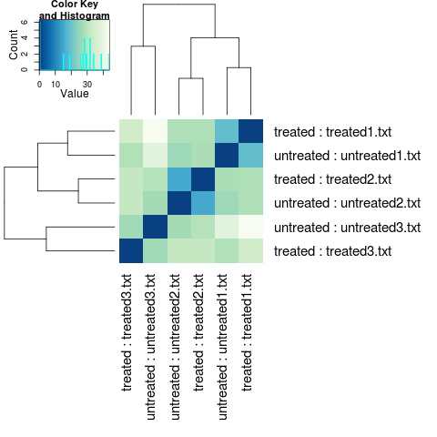
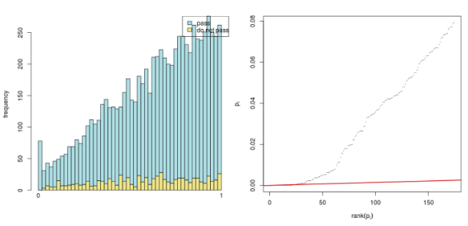

# DESeq2-Tutorial
A transliteration of the DESeq2 Tutorial by Dave Wheeler which no long seems to be live, so I'm preserving it in case it disappears from the WaybackMachine.

##### Uploaded by J. Healey, 9th September 2018. I may continue to tidy up and improve this transliteration over time.

##### Disclaimer: I have not tested this workflow, and cannot vouch for the demo files, though I've bundled them in the repo too, however I have gone to the effort of sourcing and including the images which does not happen automatically on HTML -> .md conversion.

##### Additionally, I've moved all the comments on the thread to `comments.md` since it's a bit of a parsing nightmare, just in case there is useful information in there still.

##### Feel free to post issues to discuss the walkthrough, but I'm no DeSeq expert, so I'll only be of limited help.

##### I also have not tested all the embedded links, so cannot speak for their intact-ness. I have removed their links to the WaybackMachine too, so some will work, while others will still be offline.

Converted with https://github.com/aaronsw/html2text

Originally posted on the [Dave Wheeler lab page.](http://dwheelerau.com/)
And originally retrieved via:
http://dwheelerau.com/2014/02/17/how-to-use-deseq2-to-analyse-rnaseq-data/

---------

# How to use DESeq2 to analyse RNAseq data

Posted on [February 17, 2014](http://dwheelerau.com/2014/02/17/how-to-use-deseq2-to-analyse-rnaseq-data/) by [Dave Wheeler](http://dwheelerau.com/author/dwheelerau/)

__News:__ *My colleagues at NZGL have developed an open source R based GUI for generating plots using cuffdiff data. One for deseq2 will be available soon!
Feel free to [check it out](https://github.com/NZGL/shiny_cuffdiff) and get back to us with any  [suggestions](https://github.com/NZGL/shiny_cuffdiff
/issues)*. *Only requires [R-studio](https://github.com/NZGL/shiny_cuffdiff)*.

There is only one thing better than DESeq and thats DESeq2! The [updated version](http://www.bioconductor.org/packages/2.13/bioc/html/DESeq2.html) is out and I’m keen to give it a whirl. Like with my old [DESeq post](http://dwheelerau.com/2013/04/15/how-to-use-deseq-to-analyse-rnaseq-data/), once again I am really just following the excellent [DESeq2 manual](http://www.bioconductor.org/packages/2.13/bioc/vignettes/DESeq2/inst/doc/DESeq2.pdf), thanks again to the authors for the great
documentation!

Just a quick warning that I haven’t tested this workflow extensively, let me know if things don’t work. Also, DESeq2 is new so some of the function might have changed, so if you have problems makes sure you check what version you are using versus what I used (see sessionInfo below).

The files I used for this are found [here](https://drive.google.com/file/d/0B6eVTdUN1IlwdnNiMkpvV1FWMUk/edit?usp=sharing) if you want to give them a go or follow along. I’ve already got a [blow by blow run through on how to do use DESeq](http://dwheelerau.com/2013/04/15/how-to-use-deseq-to-analyse-
rnaseq-data/) and much of that applies to the new package, so here I’ll just concentrate on some DESeq2 specific stuff as well as all the graphs. I’ve included some side by side comparisons between DESeq and DESeq2.

Installing is easy:

    source('http://bioconductor.org/biocLite.R')
    biocLite('DESeq2')

One important change is that now you can directly create the count table using raw [HT-Seq-count](http://www-huber.embl.de/users/anders/HTSeq/doc/count.html) output, and I’ll show you how to do that below. Remember HT-Seq-count will create a single file for each replicate of a condition (based on an SAM alignment file), so in my case with two conditions (control and treatment) and 3 reps each, that makes a total of 6 files. I called these files treated1.txt, treated2.txt, treated3.txt, untreated1 untreated2, untreated3 so that i can use grep to import them (explained below). Previously i would use a script to merge them all together, now DESeq2 allows you to import these files directory.

Below I set the directory where the files are located; use grep to catch all these files based on the string match “treated” that they all share (be
carefully it doesn’t catch anything else), this is stored in sampleFiles. If you like you could just directly specify the files using
`sampleFiles<-c(“treated1.txt”,..etc..”untreated3.txt”)`.

 Importantly, we need to setup the sampleConditions, with the same order as that found for the file names in sampleFiles (so it knows what each files represents). Finally we make a dataframe that becomes a deseq table. Note my “#” lines are just nonfunctional comment lines that I am using to print out the output from the screen!

    library('DESeq2')
    directory<-'/home/dwheeler/Desktop/BLOG/Dec_post2'
    #use grep to search for the 'treated' part of filename to collect files
    sampleFiles<-grep('treated',list.files(directory),value=TRUE)
    # sampleFiles
    #[1] 'treated1.txt'   'treated2.txt' 'treated3.txt'  'untreated1.txt'
    #[5] 'untreated2.txt' 'untreated3.txt'

    sampleCondition<-c('treated','treated','treated','untreated','untreated','untreated')
    sampleTable<-data.frame(sampleName=sampleFiles, fileName=sampleFiles, condition=sampleCondition)
    ####
    #sampleTable
    #     sampleName       fileName condition
    #1   treated1.txt   treated1.txt   treated
    #2   treated2.txt   treated2.txt   treated
    #3   treated3.txt   treated3.txt   treated
    #4 untreated1.txt untreated1.txt untreated
    #5 untreated2.txt untreated2.txt untreated
    #6 untreated3.txt untreated3.txt untreated
    ######

    ddsHTSeq<-DESeqDataSetFromHTSeqCount(sampleTable=sampleTable, directory=directory, design=~condition)
    #####
    #ddsHTSeq
    #class: DESeqDataSet
    #dim: 7921 6
    #exptData(0):
    #assays(1): counts
    #rownames(7921): seq_1 seq_2 ... seq_7920 seq_7921
    #rowData metadata column names(0):
    #colnames(6): treated1.txt treated2.txt ... untreated2.txt
    #  untreated3.txt
    #colData names(1): condition
    #######
    colData(ddsHTSeq)$condition<-factor(colData(ddsHTSeq)$condition, levels=c('untreated','treated'))

The levels in colData are important because they are used in the log
calculations; it makes sense to set untreated or control first so that the
direction of the logs fold changes doesn’t confuse everyone (typically we do comparisons to the control)! Now for the guts of the DEseq2 analysis.

    dds<-DESeq(ddsHTSeq)
    res<-results(dds)
    res<-res[order(res$padj),]
    head(res)
    #DataFrame with 6 rows and 6 columns
    #          baseMean log2FoldChange      lfcSE      stat       pvalue
    #
    #seq_3146  997.5419      0.7894523 0.08297687  9.514125 1.832488e-21
    #seq_1802  746.3972      0.5685789 0.08533961  6.662544 2.691282e-11
    #seq_2146  406.1395      0.9424543 0.14108613  6.679993 2.389544e-11
    #seq_7548  466.5453      0.6036683 0.10178158  5.931017 3.010637e-09
    #seq_3240 1569.6556      0.6132326 0.11145966  5.501835 3.758596e-08
    #seq_958   149.6504      0.7398193 0.14154162  5.226868 1.724055e-07
    #                 padj
    #
    #seq_3146 1.299050e-17
    #seq_1802 6.359498e-08
    #seq_2146 6.359498e-08
    #seq_7548 5.335601e-06
    #seq_3240 5.328937e-05
    #seq_958  2.036971e-04

Looking good, time for some plots. BTW I’m using the same dataset I used for the original DESeq blog post (links to data and that blog at top of page).

    plotMA(dds,ylim=c(-2,2),main='DESeq2')
    dev.copy(png,'deseq2_MAplot.png')
    dev.off()

MAPlot of DESeq1 (left) and DESeq2 (right) for the same data

As expected for this dataset there are not many differentially expressed genes
(red). There certainly is a difference in the level of scatter with this
dataset using DESeq and DESeq2. Also note that there is good reduction in
scatter for low count reads (left hand side of the graph) in DESeq2 versus the original version. DESeq tends to be a conservative approach, I like that, and with that in mind the update uses a test called cooks distance to remove outliers from the analysis. [Cooks distance](http://en.wikipedia.org/wiki/Cook's_distance) looks to see how much each sample contributes to a genes overall value fold change, with samples that cause extreme effects removed. To be specific, the gene will not be analysed for differential expression if one of its samples is considered an outlier. The idea being here that we want to see only DE genes that show a consistent pattern. The draw back of this approach is that there is a loss of power, as some genes that are truly DE will be removed before the statistical tests are performed.

We can save the table, and also print out some information on what the columns mean.

    mcols(res,use.names=TRUE)
    #DataFrame with 6 rows and 2 columns
    #                       type

    #baseMean       intermediate
    #log2FoldChange      results
    #lfcSE               results
    #stat                results
    #pvalue              results
    #padj                results
                                                              #description

    #baseMean                        the base mean over all rows
    #log2FoldChange log2 fold change (MAP): condition treated vs untreated
    #lfcSE           standard error: condition treated vs untreated
    #stat            Wald statistic: condition treated vs untreated
    #pvalue          Wald test p-value: condition treated vs untreated
    #padj            BH adjusted p-values
    #write the table to a csv file
    write.csv(as.data.frame(res),file='sim_condition_treated_results_deseq2.csv')

BTW take this with a pinch of salt because its only a simple sample dataset, but the difference in gene counts is that deseq only found a single
differentially expressed gene (at padj 0.1), whilst deseq2 called this same
gene plus 23 others.  Also, reducing the cut-off multiple testing correction to 0.05 only removes 3 genes from the list with DESeq2.

Now we want to transform the raw discretely distributed counts so that we can do clustering.

    rld<- rlogTransformation(dds, blind=TRUE)
    vsd<-varianceStabilizingTransformation(dds, blind=TRUE)

Here we choose blind so that the initial conditions setting does not influence the outcome, ie we want to see if the conditions cluster based purely on the individual datasets, in an unbiased way. According to the documentation, the `rlogTransformation` method that converts counts to log2 values is apparently better than the old varienceStabilisation method when the data size factors vary by large amounts.

The code and plot below shows the [nice] effect of the transformation.

    par(mai=ifelse(1:4 <= 2, par('mai'), 0))
    px     <- counts(dds)[,1] / sizeFactors(dds)[1]
    ord    <- order(px)
    ord    <- ord[px[ord]<150]
    ord    <- ord[seq(1, length(ord), length=50)]
    last   <- ord[length(ord)]
    vstcol <- c('blue', 'black')
    matplot(px[ord], cbind(assay(vsd)[, 1], log2(px))[ord, ], type=l, lty=1, col=vstcol, xlab='n', ylab='f(n)')
    legend('bottomright', legend = c(expression('variance stabilizing transformation'), expression(log[2](n/s[1]))), fill=vstcol)
    dev.copy(png,'DESeq2_VST_and_log2.png')

Graph showing variance stabilizing transformation for sample 1 (blue) and  
of the transformation f (n) = log2 (n/s1 ) (black)

The x axis is the square root of variance over the mean for all samples, so this will naturally included variance due to the treatment. The goal here is to flattern the curve so that there is consistent variance across the read counts, and that is what we got.

    library('vsn')
    par(mfrow=c(1,3))
    notAllZero <- (rowSums(counts(dds))>0)
    meanSdPlot(log2(counts(dds,normalized=TRUE)[notAllZero,] + 1), ylim = c(0,2.5))
    meanSdPlot(assay(rld[notAllZero,]), ylim = c(0,2.5))
    meanSdPlot(assay(vsd[notAllZero,]), ylim = c(0,2.5))

This interesting plot shows the standard deviation across all samples against the mean counts using three different methods of transformation. With this data you can see that the shifted logarithm method (left) seems to do pretty badly at for low count genes, with both regularized log (center) and DESeqs variance stabilisation (right) doing a much better job across the entire dynamic range of counts.

For some reason, everyone loves a good heat map!

    library('RColorBrewer')
    library('gplots')
    select <- order(rowMeans(counts(dds,normalized=TRUE)),decreasing=TRUE)[1:30]
    hmcol<- colorRampPalette(brewer.pal(9, 'GnBu'))(100)
    heatmap.2(counts(dds,normalized=TRUE)[select,], col = hmcol,
    Rowv = FALSE, Colv = FALSE, scale='none',
    dendrogram='none', trace='none', margin=c(10,6))
    dev.copy(png,'DESeq2_heatmap1')
    dev.off()
    heatmap.2(assay(rld)[select,], col = hmcol,
    Rowv = FALSE, Colv = FALSE, scale='none',
    dendrogram='none', trace='none', margin=c(10, 6))
    dev.copy(png,'DESeq2_heatmap2')
    dev.off()
    heatmap.2(assay(vsd)[select,], col = hmcol,
    Rowv = FALSE, Colv = FALSE, scale='none',
    dendrogram='none', trace='none', margin=c(10, 6))
    dev.copy(png,'DESeq2_heatmap3')
    dev.off()

The above shows heatmaps for 30 most highly expressed genes (not necessarily the biggest fold change). The data is of raw counts (left), regularized log transformation (center) and from variance stabilizing transformation (right) and you can clearly see the effect of the transformation has by shrinking the variance so that we don’t get the squish effect shown in the left hand graph.

Now we calculate sample to sample distances so we can make a dendrogram to
look at the clustering of samples.

    distsRL <- dist(t(assay(rld)))
    mat<- as.matrix(distsRL)
    rownames(mat) <- colnames(mat) <- with(colData(dds),
    paste(condition,sampleFiles , sep=' : '))

    #updated in latest vignette (See comment by Michael Love)
    #this line was incorrect
    #heatmap.2(mat, trace='none', col = rev(hmcol), margin=c(16, 16))
    #From the Apr 2015 vignette
    hc <- hclust(distsRL)
    heatmap.2(mat, Rowv=as.dendrogram(hc),
    symm=TRUE, trace='none',
    col = rev(hmcol), margin=c(13, 13))
    dev.copy(png,'deseq2_heatmaps_samplebysample.png')
    dev.off()

Although this result looks terrible, as we would expect samples to cluster by treatment, in this case I’m actually happy by this result. Why? Well this was actually a control experiment to show that slightly different (and
unavoidable) experimental setup for the different samples, wasn’t responsible for the observed expression differences, so seeing that there is little treatment effect makes me happy. Remember, always *try* and do what Fisher tells us to, [replicate, randomised, block](http://en.wikipedia.org/wiki/Design_of_experiments).

Similarly the PCA.

    print(plotPCA(rld, intgroup=c('condition')))
    dev.copy(png,'deseq2_pca.png')
    dev.off()

  

I hope your’s looks better!

Previously we talked about the cooks distance treatment of outliers, in that a
gene is thrown away if one of its samples is deemed to be an outlier. You may
not want this to happen so DESeq2 we can take a different approach by
replacing the outlier value with one estimated value as predicted by the
distribution using the [trimmed mean](http://en.wikipedia.org/wiki/Truncated_mean) approach. DESeq2 recomends you
only do this if you have several replicates per treatment, and indeed it
automatically uses this feature if you have 7 or more replicates in your
datatable.

    ddsClean <- replaceOutliersWithTrimmedMean(dds)
    ddsClean <- DESeq(ddsClean)
    tab <- table(initial = results(dds)$padj < .1,
    cleaned = results(ddsClean)$padj < .1)
    addmargins(tab)
    write.csv(as.data.frame(tab),file='sim_condition_treated_results_cleaned_summary_deseq2.csv')
    resClean <- results(ddsClean)
    write.csv(as.data.frame(resClean),file='sim_condition_treated_results_cleaned_deseq2.csv')

In my case it didn’t really make much difference.

Dispersion plot shows how the estimates are shrunk from the gene wise values (black dots) toward the fitted estimates, with the final values used in testing being the blue dots.

    plotDispEsts(dds)

And a comparison of DeSeq1 vs DeSeq2 (left and right respectively):

Now independent filtering to remove any tests that have little chance of pass to reduce the number of tests we have to perform, thus reducing the effects of multiple testing error. (false discovery). You can see how many genes are rejected based on different values of alpha (FDR)

    #filtering threashold
    attr(res,'filterThreshold')
    #     10%
    #91.48005
    plot(attr(res,'filterNumRej'),type='b', ylab='number of rejections')
    dev.copy(png,'deseq2_filtering_treshold.png')
    dev.off()

    W <- res$stat
    maxCooks <- apply(assays(dds)[['cooks']],1,max)
    idx <- !is.na(W)
    plot(rank(W[idx]), maxCooks[idx], xlab='rank of Wald statistic',
    ylab='maximum Cook's distance per gene',
    ylim=c(0,5), cex=.4, col=rgb(0,0,0,.3))
    m <- ncol(dds)
    p <- 3
    abline(h=qf(.99, p, m - p))
    dev.copy(png,'deseq2_cooksdist.png')
    dev.off()

Plot of the maximum Cook’s distance per gene over the rank of the Wald
statistics for the condition.

Here more about independent filtering. What it shows in genes with very low
counts are unlikely to have a significant p-value due to excessive dispersion at the left side of the dynamic range of counts. The y-axis here is -log10, so bigger numbers are smaller p-values (better).

    plot(res$baseMean+1, -log10(res$pvalue),
    log='x', xlab='mean of normalized counts',
    ylab=expression(-log[10](pvalue)),
    ylim=c(0,30),
    cex=.4, col=rgb(0,0,0,.3))
    dev.copy(png,'deseq2_indep_filt.png')
    dev.off()

All those dots on the left hand side the graph represent failed tests due to very low count values, thus we can really just get rid of them to reduce our chance of making a type I error.

And again, you can see that only a few small (or no) p-values are discarded by the filtering. NOTE: You might only see blue lines [I’ve broken something??]

    use <- res$baseMean > attr(res,'filterThreshold')
    table(use)
    h1 <- hist(res$pvalue[!use], breaks=0:50/50, plot=FALSE)
    h2 <- hist(res$pvalue[use], breaks=0:50/50, plot=FALSE)
    colori <- c('do not pass'='khaki', 'pass'='powderblue')
    barplot(height = rbind(h1$counts, h2$counts), beside = FALSE,
    col = colori, space = 0, main = '', ylab='frequency')
    text(x = c(0, length(h1$counts)), y = 0, label = paste(c(0,1)),
    adj = c(0.5,1.7), xpd=NA)
    legend('topright', fill=rev(colori), legend=rev(names(colori)))

  

The graph on the left ranks the p-values from smallest to biggest (x-axis) and plots them. The black line is the actual p-value numbers (remember only about 23 genes had a p-value lower than 0.05). The red line has a slope that represents the number of tests divided by the false discovery rate (0.1). The idea here is the FDR is controlled at the 0.1% value for all tests that occur to the left of the right-most intersection of the black and red line.

The code for the right hand plot above.

    resFilt <- res[use & !is.na(res$pvalue),]
    orderInPlot <- order(resFilt$pvalue)
    showInPlot <- (resFilt$pvalue[orderInPlot] <= 0.08)
    alpha <- 0.1

    plot(seq(along=which(showInPlot)), resFilt$pvalue[orderInPlot][showInPlot],
    pch='.', xlab = expression(rank(p[i])), ylab=expression(p[i]))
    abline(a=0, b=alpha/length(resFilt$pvalue), col='red3', lwd=2)

    sessionInfo()
    R version 3.0.2 (2013-09-25)
    Platform: x86_64-pc-linux-gnu (64-bit)

    locale:
    [1] LC_CTYPE=en_US.UTF-8 LC_NUMERIC=C
    [3] LC_TIME=en_US.UTF-8 LC_COLLATE=en_US.UTF-8
    [5] LC_MONETARY=en_US.UTF-8 LC_MESSAGES=en_US.UTF-8
    [7] LC_PAPER=en_US.UTF-8 LC_NAME=C
    [9] LC_ADDRESS=C LC_TELEPHONE=C
    [11] LC_MEASUREMENT=en_US.UTF-8 LC_IDENTIFICATION=C

    attached base packages:
    [1] parallel stats graphics grDevices utils datasets methods
    [8] base

    other attached packages:
    [1] gplots_2.12.1 RColorBrewer_1.0-5 BiocInstaller_1.12.0
    [4] DESeq2_1.2.8 RcppArmadillo_0.3.920.3 Rcpp_0.10.6
    [7] GenomicRanges_1.14.3 XVector_0.2.0 IRanges_1.20.6
    [10] BiocGenerics_0.8.0

    loaded via a namespace (and not attached):
    [1] affy_1.40.0 affyio_1.30.0 annotate_1.40.0
    [4] AnnotationDbi_1.24.0 Biobase_2.22.0 bitops_1.0-6
    [7] caTools_1.16 DBI_0.2-7 DESeq_1.14.0
    [10] gdata_2.13.2 genefilter_1.44.0 geneplotter_1.40.0
    [13] grid_3.0.2 gtools_3.1.1 KernSmooth_2.23-10
    [16] lattice_0.20-24 limma_3.18.5 locfit_1.5-9.1
    [19] preprocessCore_1.24.0 RSQLite_0.11.4 splines_3.0.2
    [22] stats4_3.0.2 survival_2.37-4 tools_3.0.2
    [25] vsn_3.30.0 XML_3.98-1.1 xtable_1.7-1
    [28] zlibb

[Updated July ’14: to fix errors with distance matrix plot, cooks distance,
and the Benjamini-Hochberg multiple testing adjustment procedure (props to
Stefan for pointing them out]

### *Related*

- [How to use DESeq to analyse RNAseq data](http://dwheelerau.com/2013/04/15
/how-to-use-deseq-to-analyse-rnaseq-data/)

- [Pandas, matplotlib and Ipython - all you need for great data
anaylsis](http://dwheelerau.com/2012/08/10/pandas-matplotlib-and-ipython-all-you-need-for-great-data-anaylsis/)

- [Setting up a Lubuntu virtual machine with virtual box [and get guest
additions working]](http://dwheelerau.com/2014/01/25/setting-up-a-lubuntu-
virtual-machine-with-virtual-box/)

-------
This entry was posted in [Bioinformatic's](http://dwheelerau.com/category/bioinformatics/), [Programing](http://dwheelerau.com/category/programing/)
and tagged [DESeq](http://dwheelera
u.com/tag/deseq/), [DESeq2](http://dwheelerau.com/tag/deseq2/), [gene expression](http://dwheelerau.com/tag/gene-expression/),
[R](http://dwheelerau.com/tag/r/), [RNAseq](http://dwheelerau.com/tag/
rnaseq/) by [Dave Wheeler](http://d
wheelerau.com/author/dwheelerau/).

------
